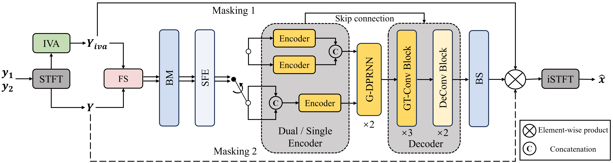

# H-GTCRN
This repository is the official implementation of the Interspeech2025 paper: A Lightweight Hybrid Dual Channel Speech Enhancement System under Low-SNR Conditions.
>Audio samples and preprint paper are coming soon.

<em>Fig.1: The framework of our proposed system.</em>

# Credits
We gratefully acknowledge the following resources that made this project possible:
- [GTCRN](https://github.com/Xiaobin-Rong/gtcrn): SOTA lightweight speech enhancement model architecture.
- [SE-train](https://github.com/Xiaobin-Rong/SEtrain): Excellent training code template for DNN-based speech enhancement.
- [pyroomacoustics](https://github.com/LCAV/pyroomacoustics)
